# 🌌 Rendler Industries: The Family OS

A hyper-integrated, full-stack home laboratory and family management ecosystem. Built with **Modern Perl** and the **Mojolicious** real-time framework, this platform centralizes household automation, organization, and entertainment into a secure, glassmorphic dashboard.

---

## 🛠 Tech Stack & Infrastructure

### **The Core Engine**
*   **Framework:** [Mojolicious](https://mojolicious.org/) - Utilizing Non-blocking I/O, WebSockets, and a modular Controller-Model-Plugin architecture.
*   **Web Server:** `Hypnotoad` - Enabling zero-downtime hot-reloads and multi-process worker management.
*   **Database:** **MariaDB 10.x** - Relational storage with strict foreign keys and polymorphic ledger tables.
*   **Native Orchestration:** Background maintenance loops handling temporal state tracking, idempotency, and proactive system-wide synchronization.
*   **Security:** 
    *   Tiered RBAC (Guest → User → Family → Admin).
    *   Manual admin approval workflow for new registrations.

### **📡 The Multi-Channel Notification Hub**
The system features a redundant, priority-weighted alert engine for real-time and scheduled notifications:
1.  **Discord (Primary):** Real-time DMs via local API integration for immediate action.
2.  **Gotify:** Self-hosted push notifications for system-level alerts and infrastructure monitoring.
3.  **Gmail/SMTP:** Redundant email delivery for complex data (like Calendar invitations, impending event reminders, or receipt exports).
4.  **Pushover:** Mobile-first emergency alerts for critical infrastructure events.

### **🧠 AI & OCR Infrastructure**
*   **Gemini 2.0 Engine:** Integrated LLM for context-aware household automation and conversational support.
*   **Vision & OCR Pipeline:** Custom high-fidelity processing using ImageMagick and Tesseract for document digitization.
*   **Intelligent Caching:** SHA-256 fingerprinting for Translation and TTS (Text-to-Speech) results to ensure rapid, cost-effective API utilization.

---

## 👑 Administrative & Orchestration

### 👥 User & Role Control (`/users`)
*   **Approval Workflow:** Registrations are sequestered in a `pending` state. Admins receive alerts and can approve accounts with a single click, triggering an **automated welcome email**.
*   **Role Management:** Real-time toggling of `Admin` and `Family` flags.
*   **Profile Audit:** Manage user Discord IDs, email addresses, and perform secure password resets.

### 🧭 Dynamic Menu Management (`/menu`)
*   **Hierarchical Structure:** Database-driven menu supporting parent/child nesting and separators.
*   **Live Reordering:** AJAX-based drag-and-drop interface for managing link priority (`sort_order`).
*   **Visibility Logic:** Links are dynamically filtered based on the current user's permission level.

### ⚙️ Global Settings (`/settings`)
*   **System Variables:** Centralized management of application constants, such as **Timer Reset Hours** and **Quiet Hour** configurations.

  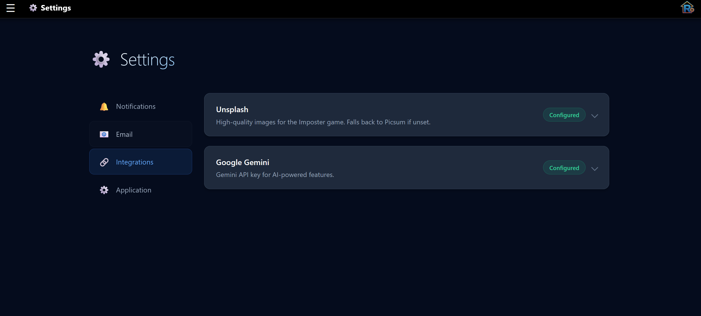

### 🧠 Family Pulse AI (`/ai`)
*   **Gemini 2.0 Integration:** Powered by Google's Gemini 2.0 Flash model for lightning-fast analysis and household reasoning.
*   **Dashboard Awareness:** Generates real-time context snapshots across all modules (Medication, Calendar, Shopping, Swear Jar) to provide holistic household advice.
*   **Multimodal Vision:** Direct integration with the File Vault and Receipt pipeline for image-based analysis and automated data entry.
*   **Persistent Memory:** Maintains long-term conversational history to ensure continuity in complex planning tasks.

  *Screenshots coming soon...*

---

## 📅 Productivity Suite

### 🗓 Advanced Family Calendar (`/calendar`)
*   **Interactive Views:** Switch seamlessly between **Month, Week, Day, and List** modes via FullCalendar.
*   **Event Intelligence:** 
    *   **Cloning:** One-click duplication of existing events for fast scheduling.
    *   **Attendee Tagging:** Tag specific family members to personalize their views and notify them.
    *   **Automated Broadcasting:** System-wide email alerts to all family members when new events are added.
    *   **Proactive Reminders:** Multi-channel alerting (Discord, Email, Gotify, Pushover) triggered before event start times for specific attendees.
    *   **Color Coding:** Categorize events (Doctor, School, Social) with dynamic hex-code styling.

  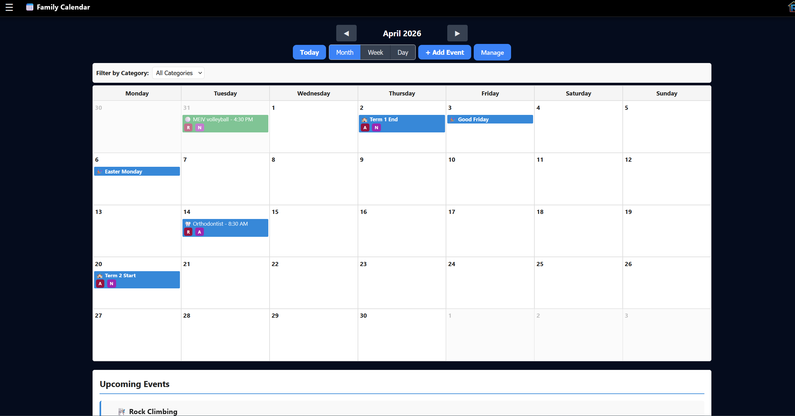
  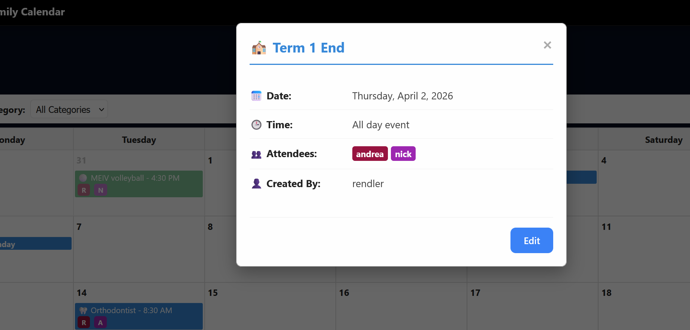

  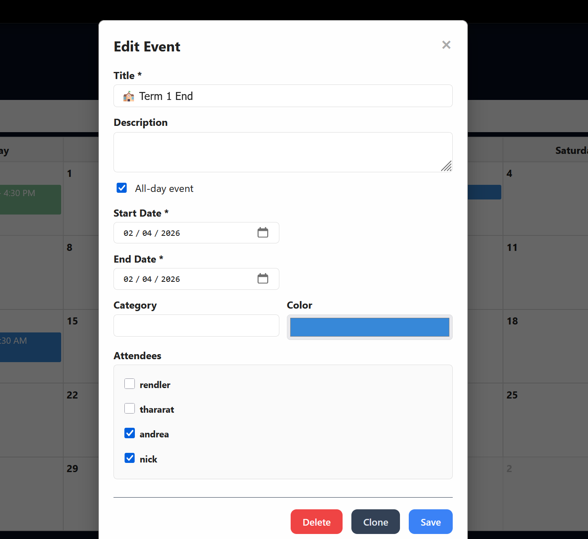
  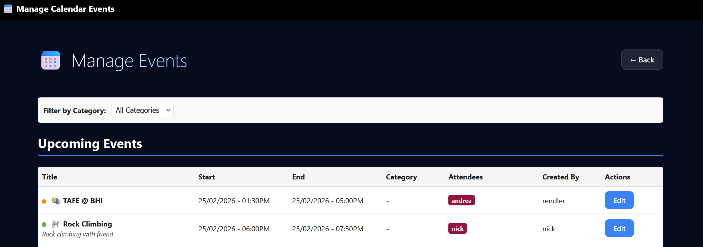

### 🧹 Bounty Board & Chores (`/chores`)
*   **Point-Based Economy:** Gamified household management where completing chores earns transferable reward points.
*   **Atomic Claiming:** Conflict-free claiming system ensures only one family member can claim a "bounty" at a time.
*   **Admin Quick-Add:** Dynamic templates based on historical chore data for rapid board updates.
*   **Historical Audit:** Detailed tracking of completed tasks, including completion timestamps and assigned contributors.

  *Screenshots coming soon...*

### 🍲 Collaborative Meal Planner (`/meals`)
*   **4-Day Rolling Window:** Dynamic schedule management with automated plan generation.
*   **Democratic Voting:** Family members can suggest meals and vote on favorites to reach a consensus.
*   **Meal Vault:** Centralized autocomplete database of historical family favorites for effortless entry.
*   **Admin Lock-in:** Finalize daily choices and set "Blackout" reasons for special events or eating out.

  *Screenshots coming soon...*

### 💊 Medication Tracker (`/medication`)
*   **Integrated Reminders:** Automated follow-up alert scheduling (1-12h) directly from the dose reset modal.
*   **Full AJAX Suite:** 100% SPA interface with real-time interval calculation (e.g., "Taken 4h 20m ago").
*   **Modern Selection UI:** Interactive pill-button selectors for delay and recipients to eliminate dropdown friction.
*   **Smart Registry:** Shared medication database with default dosages for lightning-fast entry.

  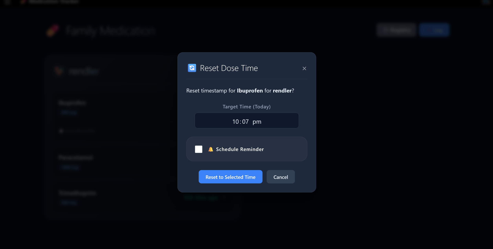

### 🔔 Smart Reminders (`/reminders`)
*   **Real-time Synchronization:** 100% SPA implementation with 60s background polling and live countdowns.
*   **Recurring Engine:** Rule-based scheduling with **Midnight Rollover Protection** to ensure notifications never skip date boundaries.
*   **Multi-User Mapping:** Link multiple recipients to a single alert via Discord and Gotify.
*   **Self-Cleaning:** Automated deletion of "One-off" reminders after successful delivery.

  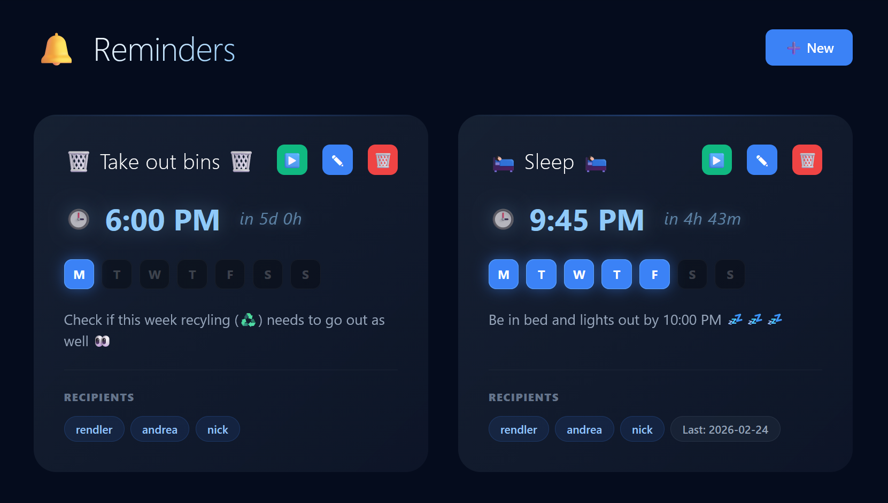
  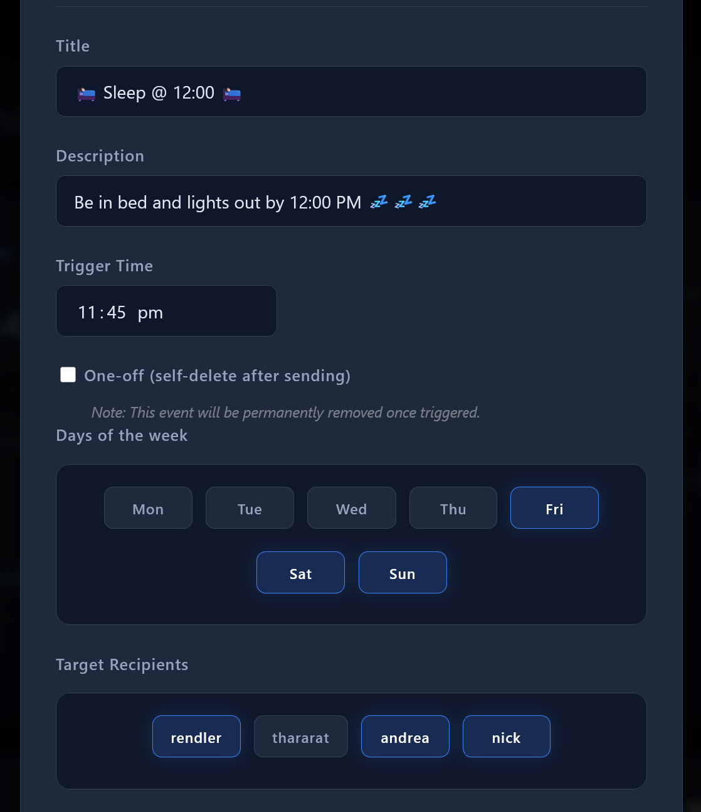

### 🛒 Collaborative Shopping & Todo (`/shopping`, `/todo`)
*   **Live Sync:** AJAX-driven status toggles for real-time synchronization across the household.
*   **User Scoping:** Todo lists are private and segregated, while Shopping lists are shared family-wide.

  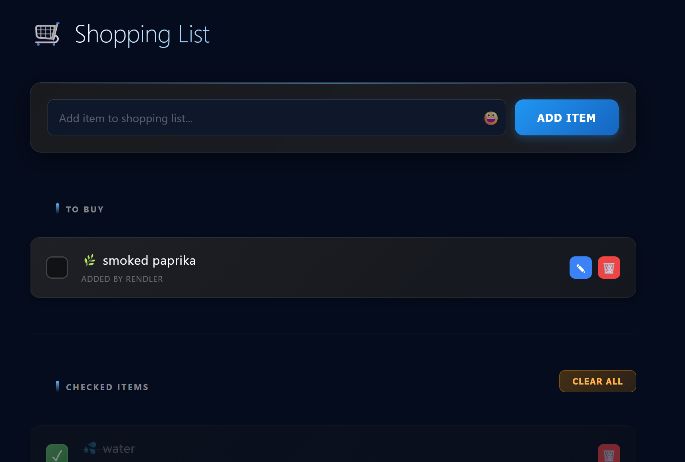
  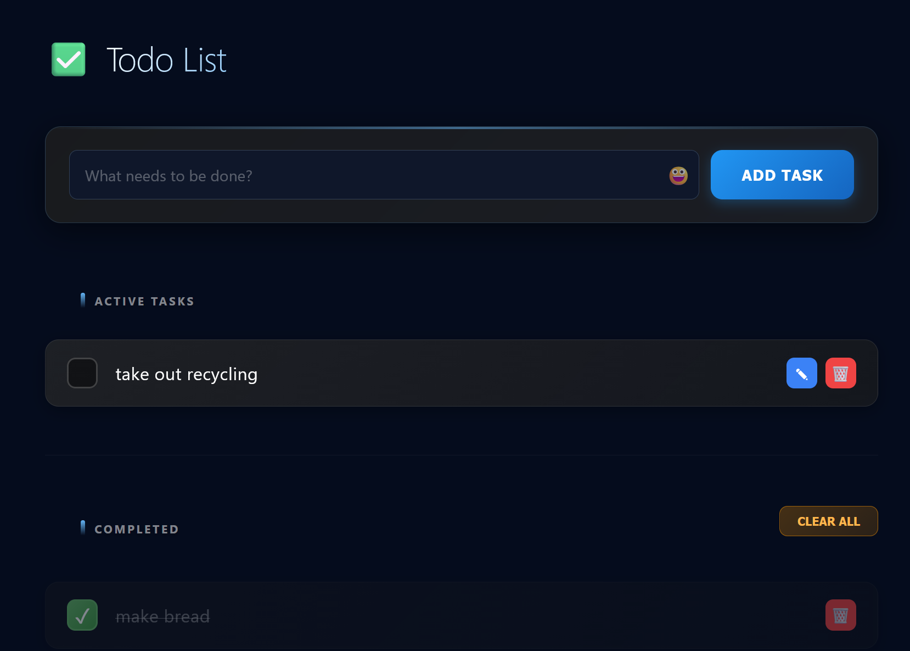

### 📓 Sticky Notes & Virtual Whiteboard (`/notes`)
*   **Infinite Canvas:** High-fidelity sticky note orchestration with real-time panning and zooming (60 FPS).
    *   **Intuitive Controls:** Natural panning (Mouse Wheel) and precise zooming (CTRL + Mouse Wheel) for professional-grade navigation.
*   **Integrated Markdown:** 
    *   **Interactive Task Lists:** Native `- [ ]` and `- [x]` toggles for lifecycle management.
    *   **Styling Engine:** Supports `**bold**`, `*italic*`, and `[color:#hex]` accentuation.
    *   **Cross-Linking:** Deep-link between notes using `[note:ID]` syntax.
*   **Media Embedding:** Direct image pasting and `[image:ID:scale]` embedding for high-fidelity visual documentation.

  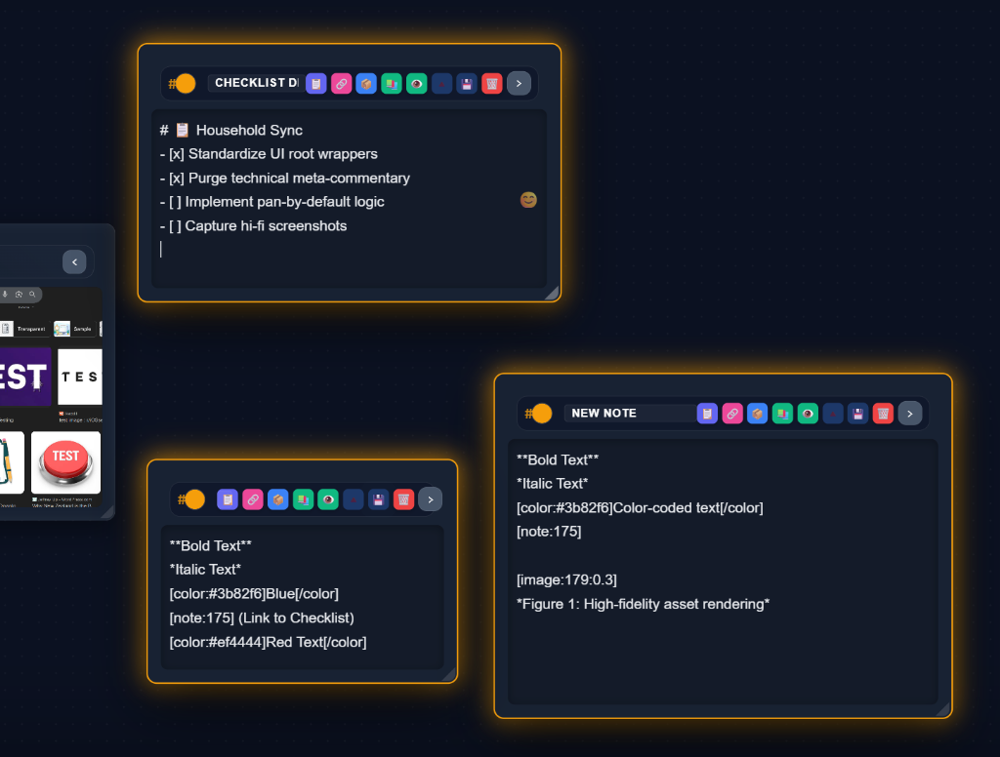
  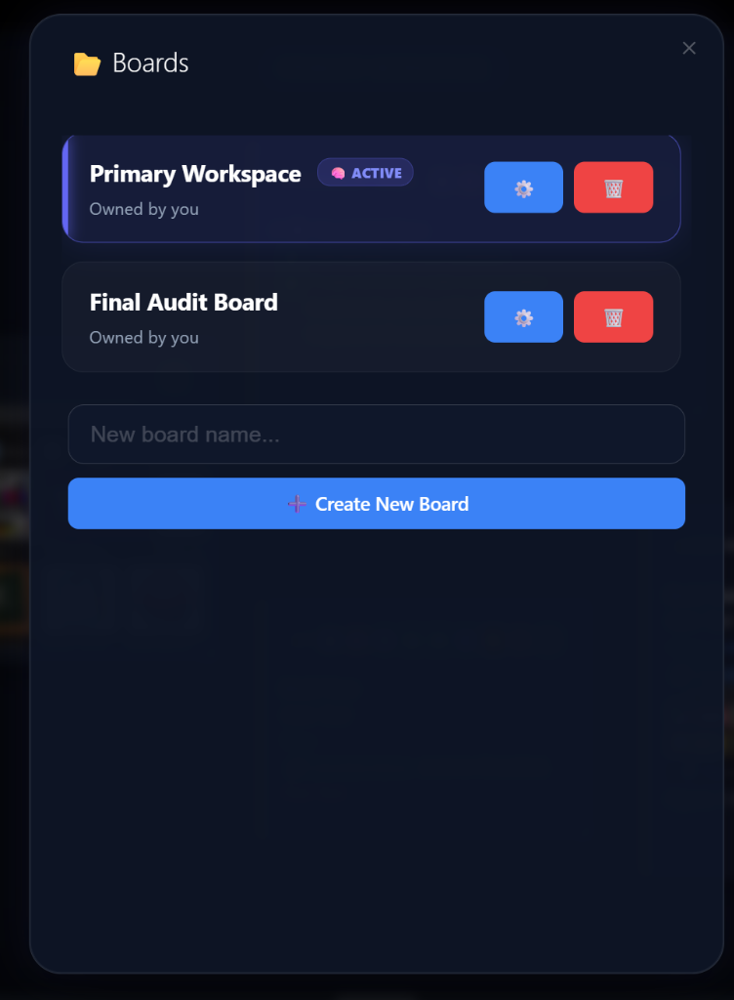
  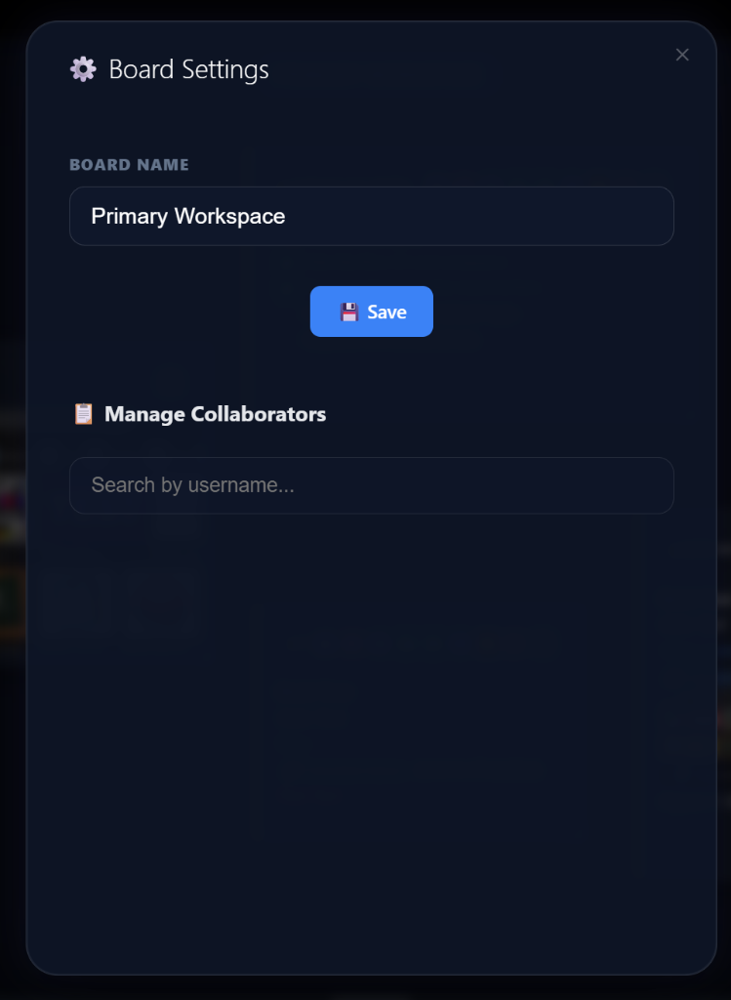
  
  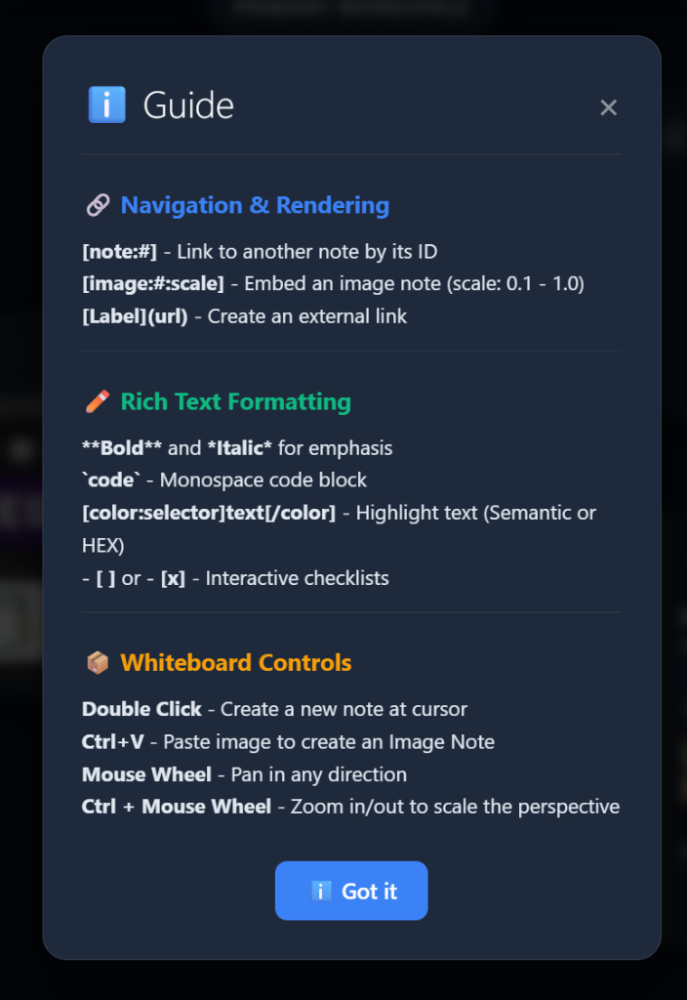

---

## 💰 Financial & Behavioral Management

### 🏆 Gamification & Child Rewards (`/points`)
*   **Child-Centric Ledger:** Dedicated point tracking for children to manage earned rewards from chores and behavioral milestones.
*   **Transaction Audit:** Full historical visibility for both parents and children into all deposits and expenditures.
*   **Global Leaderboard:** Comparative balance tracking to encourage healthy household participation.

  *Screenshots coming soon...*

### 🧾 Receipt Archiving & OCR Pipeline (`/receipts`)
*   **Automated Parsing:** Uses an advanced **ImageMagick + Tesseract OCR** pipeline.
*   **Image Pre-processing:** Automated grayscale conversion, sharpening, and 40% threshold deskewing.
*   **Heuristic Extraction:** Custom Perl Regex engine parses store names, dates, and currency totals from raw text.

  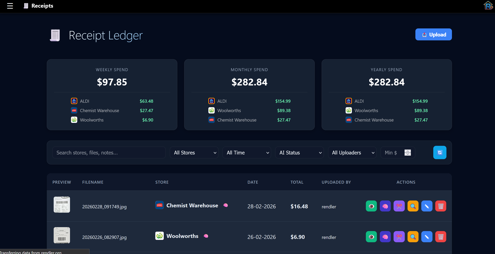
  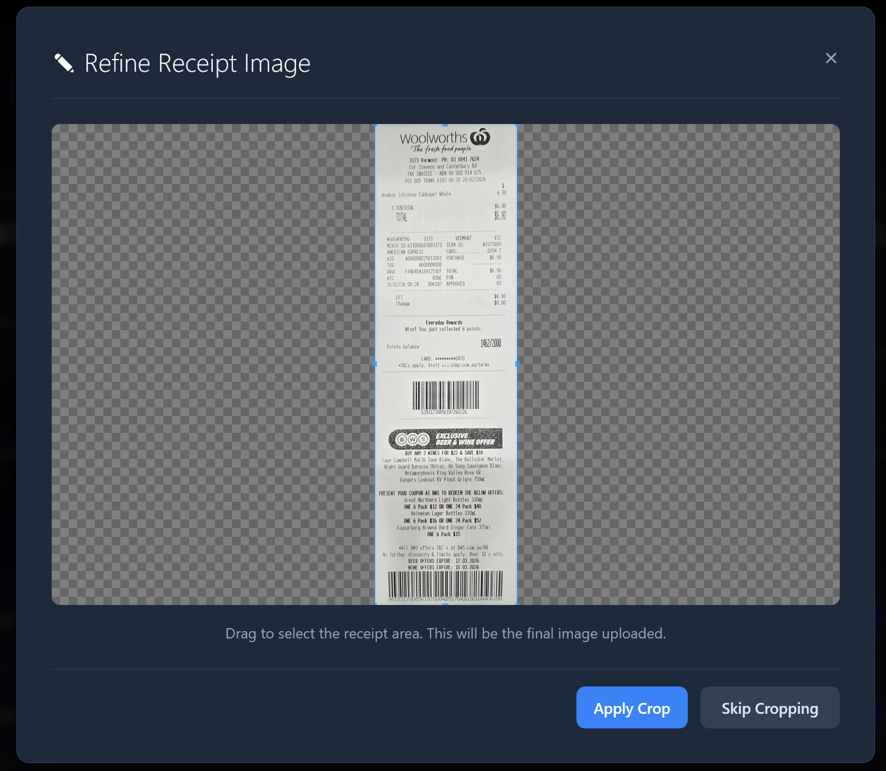
  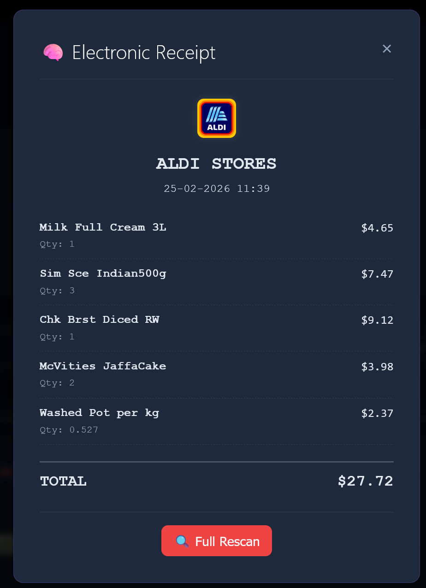

### 🤬 The Swear Jar Ledger (`/swear`)
*   **Polymorphic Ledger:** Unified tracking of fines, payments, and expenditures with 100% AJAX synchronization.
*   **Shame Leaderboard:** Real-time net-debt calculation (Fines vs. Payments) to ensure family accountability.
*   **Smart Reconciliation:** Automated debt settlement logic (FIFO) upon jar deposits.
*   **AI Context Integration:** Financial data is fed into the Gemini AI snapshot for behavioral analysis.

  *Screenshots coming soon...*

### 📁 Secure File Vault (`/files`)
*   **BLOB Storage:** Secure database-backed storage for arbitrary binaries with download tracking.
*   **Permission Control:** Granular access management (Admin-only vs. Specific User whitelists).
*   **Lightweight Metadata:** Fast browsing via optimized queries that exclude heavy binary content during list operations.

  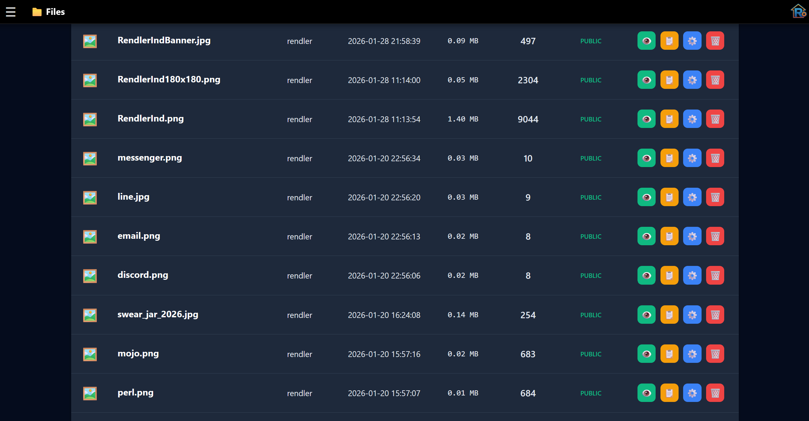

---

## 🎮 Entertainment & Social

### 🃏 UNO Multiplayer (`/uno/lobby`)
*   **Full State Machine:** Digital implementation of standard UNO rules (Skips, Reverses, Wild Draw 4).
*   **Real-time Interaction:** AJAX polling for turn tracking, hand synchronization, and "UNO!" shouting.
*   **Deck Logic:** Automatic reshuffling of the discard pile when the draw pile is exhausted.

### ♟️ Digital Chess (`/chess/lobby`)
*   **State Persistence:** Uses **FEN (Forsyth-Edwards Notation)** strings to maintain board states across sessions.
*   **Advanced Features:** Move polling, standard algebraic notation tracking, and draw negotiations.

### 🔴 Connect 4 (`/connect4/lobby`)
*   **Gravity Engine:** Custom server-side logic handles chip placement and gravity.
*   **Win Detection:** Automated scanning of Horizontal, Vertical, and Diagonal vectors for 4-in-a-row.

### 🎭 Imposter & 🦘 Citizenship Test (`/imposter`, `/quiz`)
*   **Imposter:** Party game with customizable word-lists and player reveal mechanics.
*   **Citizenship Quiz:** Dual-mode study suite (Practice vs. 20-question Exam) with randomized question banks.

---

## 🏖 Specialized & Utility

### 🌦 Weather Dashboard (`/weather`)
*   **Multi-Location Tracking:** Real-time meteorological data for multiple global locations (e.g., Mitcham, Chelsea, Bangkok).
*   **Advanced Detail Engine:** 
    *   **Interpolated Forecasting:** Scrapes source data and interpolates it into granular 2-hour blocks with temperature trend graphing.
    *   **Deep Metrics:** High-fidelity tracking of UV Index, Humidity, Moon Phases, Wind Chill, and Visibility.
*   **Threshold Styling:** Dynamic color-coded alerts based on temperature and wind intensity for rapid visual auditing.

  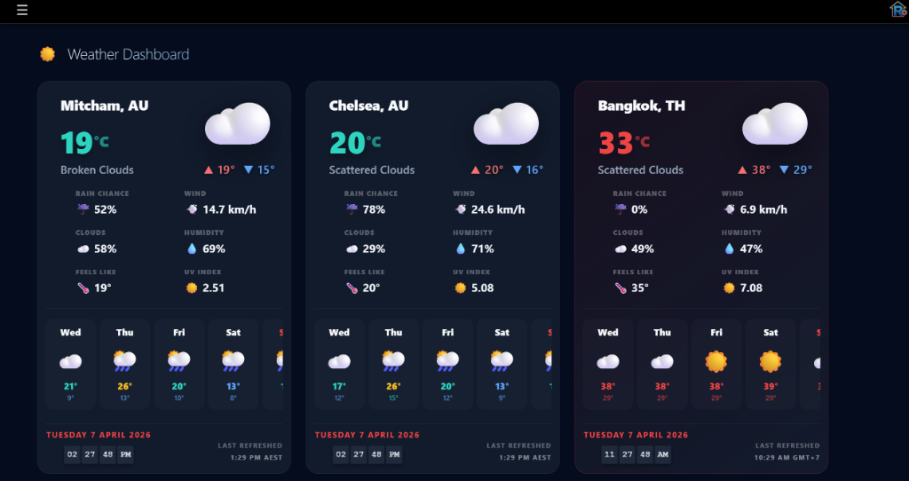
  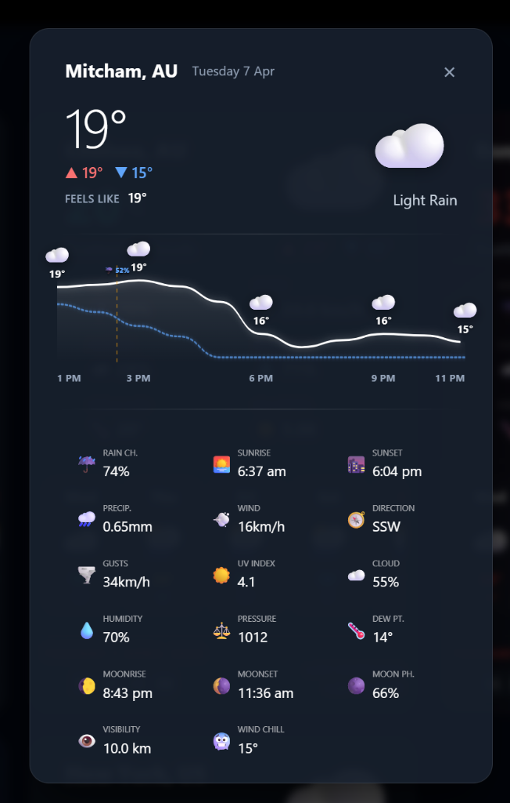

### ⏱ Household Timers (`/timers`)
*   **Limit Enforcement:** Weekday vs. Weekend daily minute limits per device category.
*   **Quiet Hours:** Automatic start-blocking during configured quiet periods (e.g., 9PM - 7AM).
*   **Bonus Time:** Administrative interface for granting extra time to specific user sessions.

  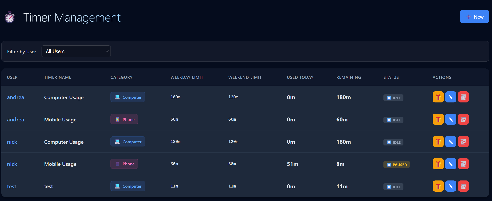

### 🎂 Birthday Tracker (`/birthdays`)
*   **Cyclical Sort:** Specialized SQL engine that ranks birthdays by nearest upcoming date, regardless of the current year.

### 🔗 Go Links & 📋 Clipboard (`/go`, `/clipboard`)
*   **Go Links:** Internal URL shortener with visit analytics.
*   **Clipboard:** Cross-device pastebin with instant notifications for user `rendler`.

  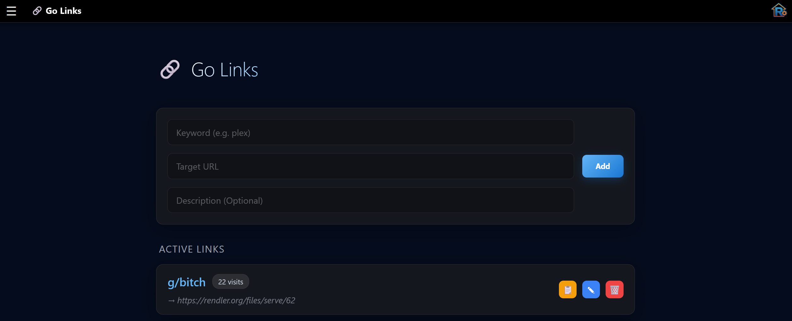
  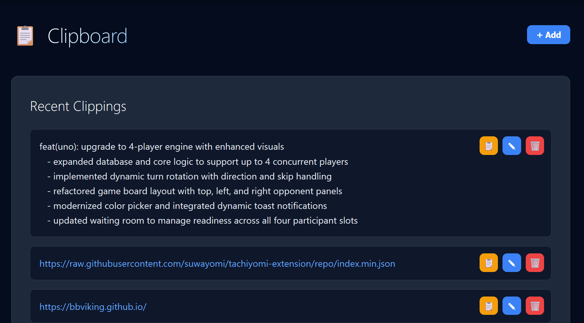

---

*Engineered for the modern digital home.*
