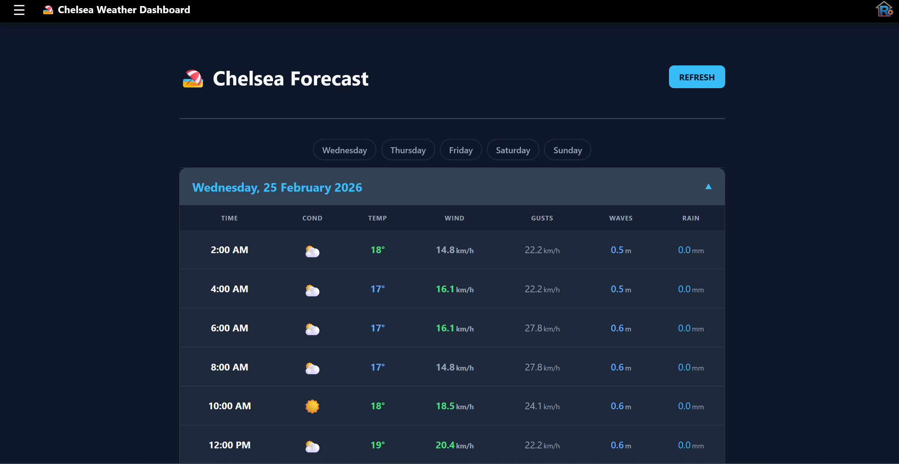

# 🌌 Rendler Industries: The Family OS

A hyper-integrated, full-stack home laboratory and family management ecosystem. Built with **Modern Perl** and the **Mojolicious** real-time framework, this platform centralizes household automation, organization, and entertainment into a secure, glassmorphic dashboard.

---

## 🛠 Tech Stack & Infrastructure

### **The Core Engine**
*   **Framework:** [Mojolicious](https://mojolicious.org/) - Utilizing Non-blocking I/O, WebSockets, and a modular Controller-Model-Plugin architecture.
*   **Web Server:** `Hypnotoad` - Enabling zero-downtime hot-reloads and multi-process worker management.
*   **Database:** **MariaDB 10.x** - Relational storage with strict foreign keys and polymorphic ledger tables.
*   **Security:** 
    *   Tiered RBAC (Guest → User → Family → Admin).
    *   Manual admin approval workflow for new registrations.

### **📡 The Multi-Channel Notification Hub**
The system features a redundant, priority-weighted alert engine:
1.  **Discord (Primary):** Real-time DMs via local API integration for immediate action.
2.  **Gotify:** Self-hosted push notifications for system-level alerts and infrastructure monitoring.
3.  **Gmail/SMTP:** Redundant email delivery for complex data (like Calendar invitations, receipt exports, or account approval confirmations).
4.  **Pushover:** Mobile-first emergency alerts for critical infrastructure events.

---

## 👑 Administrative & Orchestration

### 👥 User & Role Control (`/users`)
*   **Approval Workflow:** Registrations are sequestered in a `pending` state. Admins activate accounts via one-way toggle switches, triggering an **automated welcome email**.
*   **Role Management:** Real-time toggling of `Admin` and `Family` flags directly within the administrative ledger.
*   **Profile Audit:** Integrated modal-based editor for managing Discord IDs, email addresses, and performing secure password resets.

### 🧭 Dynamic Menu Management (`/menu`)
*   **Hierarchical Structure:** Database-driven menu supporting parent/child nesting and separators.
*   **Live Reordering:** AJAX-based drag-and-drop interface for managing link priority (`sort_order`).
*   **Visibility Logic:** Links are dynamically filtered based on the current user's permission level.

### ⚙️ Global Settings (`/settings`)
*   **System Variables:** Centralized management of application constants, such as **Timer Reset Hours** and **Quiet Hour** configurations.

---

## 📅 Productivity Suite

### 🗓 Advanced Family Calendar (`/calendar`)
*   **Interactive Views:** Switch seamlessly between **Month, Week, Day, and List** modes via FullCalendar.
*   **Event Intelligence:** 
    *   **Cloning:** One-click duplication of existing events for fast scheduling.
    *   **Attendee Tagging:** Tag specific family members to personalize their views and notify them.
    *   **Automated Emailing:** System-wide broadcast to all family members when high-priority events are added.
    *   **Color Coding:** Categorize events (Doctor, School, Social) with dynamic hex-code styling.

  
  
  

### 💊 Medication Tracker (`/medication`)
*   **Integrated Reminders:** Automated follow-up alert scheduling (1-12h) directly from the dose reset modal.
*   **Full AJAX Suite:** 100% SPA interface with real-time interval calculation (e.g., "Taken 4h 20m ago").
*   **Modern Selection UI:** Interactive pill-button selectors for delay and recipients to eliminate dropdown friction.
*   **Smart Registry:** Shared medication database with default dosages for lightning-fast entry.

### 🔔 Smart Reminders (`/reminders`)
*   **Real-time Synchronization:** 100% SPA implementation with 60s background polling and live countdowns.
*   **Recurring Engine:** Rule-based scheduling with **Midnight Rollover Protection** to ensure notifications never skip date boundaries.
*   **Multi-User Mapping:** Link multiple recipients to a single alert via Discord and Gotify.
*   **Self-Cleaning:** Automated deletion of "One-off" reminders after successful delivery.

  

### 🛒 Collaborative Shopping & Todo (`/shopping`, `/todo`)
*   **Live Sync:** AJAX-driven status toggles for real-time synchronization across the household.
*   **User Scoping:** Todo lists are private and segregated, while Shopping lists are shared family-wide.

  
  

---

## 💰 Financial & Data Management

### 🧾 Receipt Archiving & OCR Pipeline (`/receipts`)
*   **Automated Parsing:** Uses an advanced **ImageMagick + Tesseract OCR** pipeline.
*   **Image Pre-processing:** Automated grayscale conversion, sharpening, and 40% threshold deskewing.
*   **Heuristic Extraction:** Custom Perl Regex engine parses store names, dates, and currency totals from raw text.

  
  

### 🤬 The Swear Jar Ledger (`/swear`)
*   **100% SPA Architecture:** Real-time ledger updates and transaction management without page reloads.
*   **Polymorphic Ledger:** Unified tracking of fines, payments, and expenditures.
*   **Smart Reconciliation:** Automated debt settlement logic (FIFO) upon jar deposits.

### 📁 Secure File Manager (`/files`)
*   **BLOB Storage:** Secure database-backed storage for arbitrary binaries.
*   **Permission Control:** Granular access management (Admin-only vs. Specific User whitelists).

---

## 🎮 Entertainment & Social

### 🃏 UNO Multiplayer (`/uno/lobby`)
*   **Full State Machine:** Digital implementation of standard UNO rules (Skips, Reverses, Wild Draw 4).
*   **Real-time Interaction:** AJAX polling for turn tracking, hand synchronization, and "UNO!" shouting.
*   **Deck Logic:** Automatic reshuffling of the discard pile when the draw pile is exhausted.

### ♟️ Digital Chess (`/chess/lobby`)
*   **State Persistence:** Uses **FEN (Forsyth-Edwards Notation)** strings to maintain board states across sessions.
*   **Advanced Features:** Move polling, standard algebraic notation tracking, and draw negotiations.

### 🔴 Connect 4 (`/connect4/lobby`)
*   **Gravity Engine:** Custom server-side logic handles chip placement and gravity.
*   **Win Detection:** Automated scanning of Horizontal, Vertical, and Diagonal vectors for 4-in-a-row.

### 🎭 Imposter & 🦘 Citizenship Test (`/imposter`, `/quiz`)
*   **Imposter:** Party game with customizable word-lists and player reveal mechanics.
*   **Citizenship Quiz:** Dual-mode study suite (Practice vs. 20-question Exam) with randomized question banks.

---

## 🏖 Specialized & Utility

### 🏖 Chelsea Weather Dashboard (`/chelsea`)
*   **Linear Interpolation Engine:** Scrapes 3-hour source data from Windfinder and interpolates it into granular **2-hour blocks**.
*   **Threshold Styling:** Color-coded temperature and wind intensity classes for fast visual analysis.

### ⏱ Household Timers (`/timers`)
*   **Limit Enforcement:** Weekday vs. Weekend daily minute limits per device category.
*   **Quiet Hours:** Automatic start-blocking during configured quiet periods (e.g., 9PM - 7AM).
*   **Bonus Time:** Administrative interface for granting extra time to specific user sessions.

### 🎂 Birthday Tracker (`/birthdays`)
*   **Cyclical Sort:** Specialized SQL engine that ranks birthdays by nearest upcoming date, regardless of the current year.

### 🔗 Go Links & 📋 Clipboard (`/go`, `/clipboard`)
*   **Go Links:** Internal URL shortener with real-time management, visit analytics, and popularity-based sorting.
*   **Clipboard:** Cross-device pastebin with dynamic notification routing (Discord, Email, Gotify, Pushover) and touch-optimized selection UI.

  
  

---

*Engineered for the modern digital home.*
